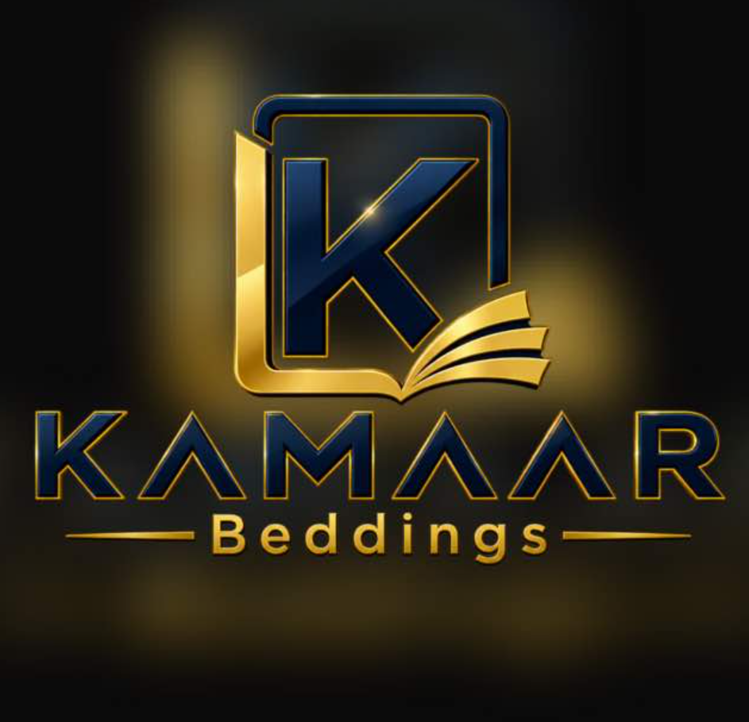

# KAMAAR Beddings (Kammar Beddings)

> **Luxury Malaysian Natural Latex & Ergonomic Hybrid Beddings E-Commerce Platform**  
> Inspired by the craftsmanship, visual quality, and trust of industry leaders like Getha.



---

## 🌟 Highlights & Features

- **Storefront & Navigation**:
  - 2-Tier luxury desktop header architecture (zero overlap, centered brand emblem, dedicated category navigation).
  - Multi-faceted mattress collection filters (material, size, firmness, price) with URL persistence.
  - Interactive bedroom lookbook with responsive product hotspot pins.
  - 60-Second Mattress Finder Quiz with deterministic preference scoring.
  - Side-by-side mattress comparison tool (up to 3 mattresses).
  - Slide-out Cart Drawer and full cart page with real-time voucher validation.
- **Malaysian Market Engineering**:
  - Currency in **MYR** formatted as `RM1,299.00`, calculated and stored in **integer sen**.
  - Strict Malaysian 5-digit postcode validation (`^\d{5}$` with leading zeros).
  - All 16 Malaysian states and federal territories supported.
  - Differentiated regional delivery: Peninsular Malaysia white-glove setup vs. East Malaysia (Sabah/Sarawak/Labuan) freight.
  - Bilingual localization: **English** and **Bahasa Melayu** with live dictionary switcher.
- **Payment & Order Consistency**:
  - Stripe Checkout integration with MYR support.
  - Isolated test payment sandbox simulator for local verification.
  - Official tax invoice and order confirmation receipt generation.
  - Atomic stock reservation and release rules.
- **Operational Admin Atelier**:
  - Role-Based Access Control (Owner, Catalog Manager, Order Manager, Content Editor).
  - Live revenue metrics, order fulfilment and courier tracking assignment.
  - Stock adjustments with mandatory operational audit logging.
  - Promotion and voucher code management (`KAMAAR100`, `KAMAARWELCOME`).

---

## 🚀 Tech Stack

- **Framework**: Next.js 14 (App Router) with TypeScript
- **Styling**: Tailwind CSS with custom luxury token palette (Deep Forest, Midnight Blue, Muted Gold, Cream, Warm White)
- **Icons**: Lucide React
- **Testing**: Vitest (13/13 commerce rules tests passing)
- **Database Schema**: 22-table Supabase SQL schema with persistent local storage

---

## 🛠️ Local Development & Quick Start

```bash
# 1. Clone the repository
git clone https://github.com/akmaldanial15/Kammar-beddings-web.git
cd Kammar-beddings-web

# 2. Install dependencies
npm install

# 3. Run unit tests
npm test

# 4. Start development server
npm run dev

# 5. Or build and run production bundle
npm run build
npm start
```

Visit `http://localhost:3000` to view the storefront, or `http://localhost:3000/admin/login` to access the Admin Atelier.

---

## 📄 License

Proprietary © KAMAAR Beddings Sdn. Bhd. All rights reserved.
